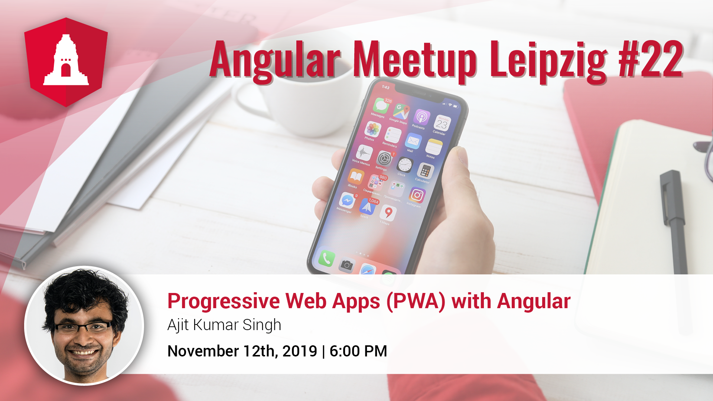

# Angular Leipzig #22 | 12.11.2019

## Progressive Web Apps (PWA) with Angular

**Speaker:** Ajit Kumar Singh

The word "PWA" gets thrown around often in web world. We will talk about what it means, the underlying technology, core functions and why they matter for the web.
We will look at the various building blocks and how they can be used to provide a native-like user experience that work even on bad or no network at all.
Finally, we will find out how easy it is to build a PWA with Angular and it's CLI and see an example in action.
There will be definitely a part 2 but we don't know when yet. It will base on this meetup.